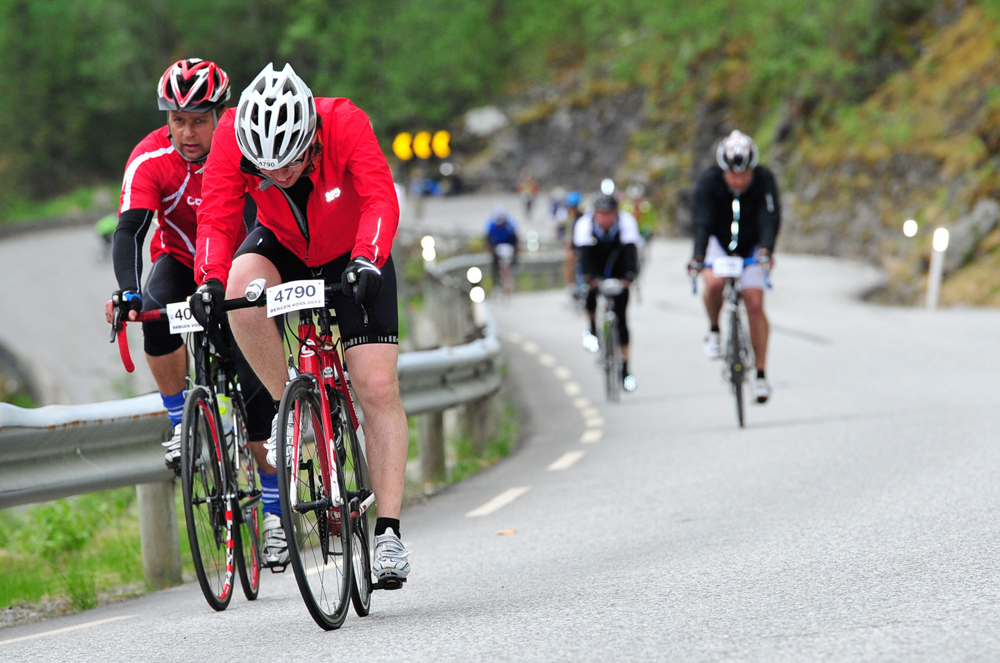
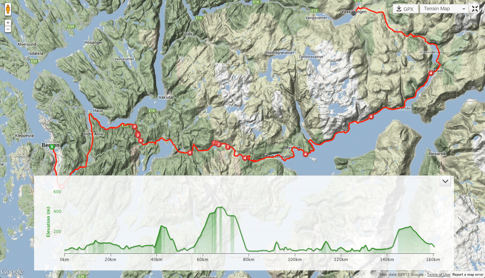

+++
title = "On Racing Bergen-Voss"
location = "Groningen, GR"
locations = ["Groningen"]
aliases = ["/2013/07/01/on-racing-in-bergen-voss/"]
date = "2013-07-01"
tags = ["cycling", "norway"]
+++

That's me riding the final climb of Bergen-Voss 2013 race, the famous road from Granvin to Voss and its hairpins around [Skjervsfossen](http://no.wikipedia.org/wiki/Skjervefossen). It was the second time I did this race, and although I had a better time than last year, I'm still at the very end of the "top 4000" list. 

It's a relatively easy, amateur race. The distance is about 165 km, but there is some climbing on the way (about 1800m), with 3 distinct climbs, one of which is rather serious:

There are two types of reactions I get when I tell people I do Bergen-Voss:

1.  'Ooh, you must be amazingly fit/strong! I would _never_ be able to even finish such a race!'
2.  'Why the hell would you do such a thing?'

Ad 1): You're wrong. Any healthy person can ride 165 km in under 10 hours. Yes, it requires some training and yes, it's best if you have a racing bike (although there are people on mountain bikes, cyclocross and even city bikes too), but no, it does not require superhuman strength, endurance or spending 30000 NOK on gear. You can just do it, if you really want to. Remember [Rule 5](http://www.velominati.com/the-rules/#5) and [Rule 6](http://www.velominati.com/the-rules/#6), and you're good.

Ad 2): Because I can, and because my job require little to no physical effort from me. I'm an academic, and this means (among many other things) that if I don't teach, I don't even have to leave my house. As a kid I was very bad at sports (I'm the classic case of a football player who plays for the team that picks last), and never really liked any physical activity, but these days, at the age of 28, I feel restless if I don't bike or run a couple of days a week. [Karolina](http://karolinakrzyzanowska.com) has the same.

Also, when it comes to Bergen-Voss in particular, I do it because it's an _amazing_ experience. The route takes you through the mountains, valleys, and along the fantastic Hardangerfjord. Breath-taking nature, people ringing cowbells on the streets, and great atmosphere all the way. I wouldn't regret it even if I came last.

Next June I will probably no longer be living in Norway, and thus I probably won't take part in Bergen-Voss again. You should, though. All you need is a roadworthy bike and some months of training. Riding all the way to Voss is not necessary, but doing a couple of 100km-long trips before the race is a good preparation. [Get on your bike and ride!](https://www.youtube.com/watch?v=2CTPLUcQAjk)
