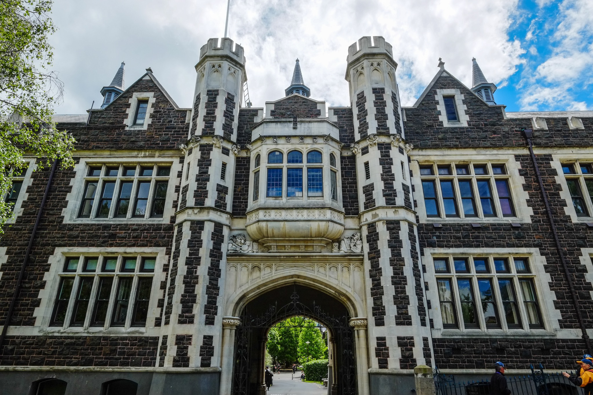

+++
title = "New Zealand"
location = "Dunedin, Otago"
locations = ["Dunedin"]
update_date = "2015-03-17"
aliases = ["/2013/12/08/new-zealand/"]
date = "2013-12-08"
tags = ["travels", "new zealand"]
+++

Last week I came to New Zealand for [COIN@PRIMA workshop](http://coin2013-prima.tudelft.nl) and [PRIMA-13](http://prima2013.otago.ac.nz) conference. It's the first time I'm on the southern hemisphere, and I have a couple of observations about New Zealand and the whole Oceania region I'd like to share. 

1. First off, New Zealand is soooper far away from *everything*. It took me more than 45 hours to get here from Bergen,[^1] and I just talked to a Kiwi friend who told me that Wellington is [the most remote](http://en.wikipedia.org/wiki/Extreme_points_of_Earth#Remoteness) capital city in the world, being furthest away from any other capital city. The feeling one has here is that while the country seems rather Western (lots of post-British architecture, English as the official language, lots of familiar products in the shops), it's very exotic. You see Fiji Airways planes at the airports, and there are weird looking trees, birds and plants everywhere. Also, New Zealanders seem to often (implicitly) refer to Australia as the "big world." Australia's where the big cities are, it's where you go to do your post-doc or PhD, and it's where many people transfer for intercontinental flights. Still, from a European point of view, Australia is the end of the world in many ways—it's vast, sparsely populated,[^2] and very far away from, well, anything.[^3] 

2. New Zealand has remarkably beautiful nature, but... somewhat less impressive for someone coming from Norway. They have fiords and mountains, but in contrast to Norway they have nice, sandy beaches, and bush forests with much more biodiversity. You could say that most of New Zealand is geographically *perfect*: it has all the beauty of Norway, and at the same time the climate is so much better. Dunedin, where I am right now, is often described as rainy by the Kiwis I know, where in fact it receives half the amount of rainfall Bergen does. It is also significantly warmer, and it's in the south of New Zealand's South Island—North Island is even better. So there you go: perfection. If only it was closer to the rest of the world...

3. Traveling to New Zealand from Europe means crossing 12 time zones (UTC+13), which creates a rather weird kind of jetlag, because night and day swap completely. I got used to it much quicker than I thought, and it results in a somewhat optimal work/holiday environment: people in Europe sleep during my day, so I get all the email communication during the night, read my emails in the morning, reply to them, and am not disturbed all day until late evening when they wake up. 

4. On a related note, going to the souther hemisphere in December is a bit confusing, but in a very pleasant way. While my friends in Norway, Netherlands and Poland shiver from cold, I was enjoying a fantastic MTB ride in 23°C yesterday. I thought Christmas decorations in the summer looked silly, but I don't mind anymore. 

5. It's a surprisingly expensive country. Food/restaurant/beer prices are more or less comparable to Amsterdam. 

6. Finally, I've fallen in love with Dunedin. It seemed a bit dull at first, but after getting to know it better I really enjoy it. It's compact, has lots of nice restaurants, it's easy to get out and enjoy the mountains or the beach, and it has the most fantastic [botanic garden](http://piotrandkarolina.wordpress.com/2013/12/04/dunedin-botanic-garden/) I've ever seen. 

So that's it. I'm writing this post on a Sunday afternoon (NZDT), and I leave on a plane to AKL-PVG-AMS-BGO tomorrow evening. I'm gonna miss you, New Zealand!

p.s.
For those of you who like photographs, you can take a look at many of the shots I took in New Zealand [here](http://piotrandkarolina.wordpress.com/category/new-zealand/). 

[^1]: To be fair, you can get from BGO to DUD in less than that (I just had some unnecessarily long layovers), but it's way more expensive, and you won't go below ~35hrs anyway. 

[^2]: Interesting factoid: I didn't realize until now that Australia only has approximately 23 mln inhabitants. That's about half the population of Poland, itself not a big country, spread over the area of 7,692,024 km2. 

[^3]: And yes, technically the most remote capital is a tie between Wellington and, surprise surprise, Canberra. 
