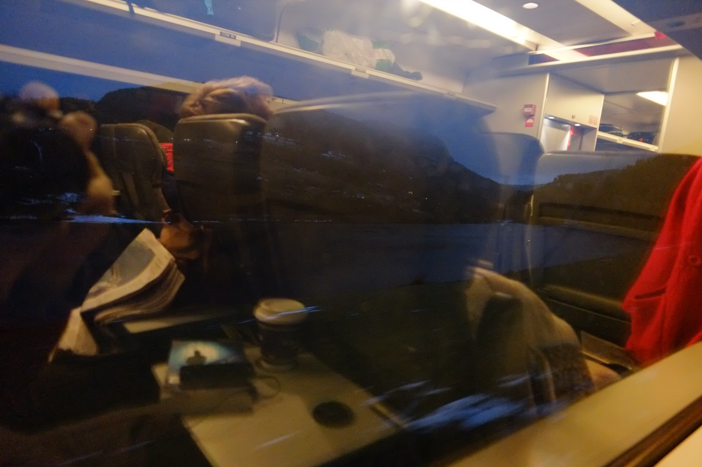
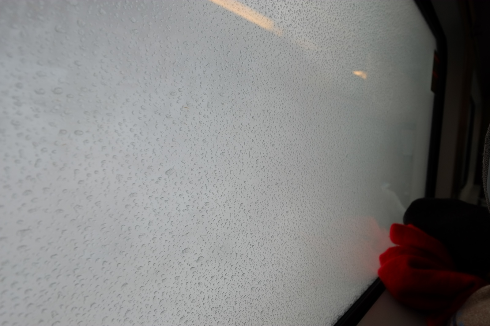
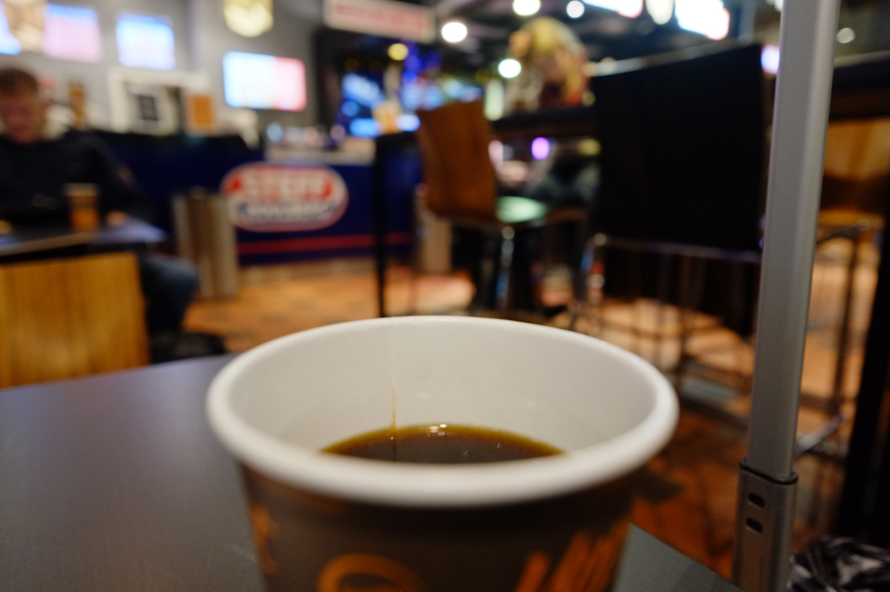
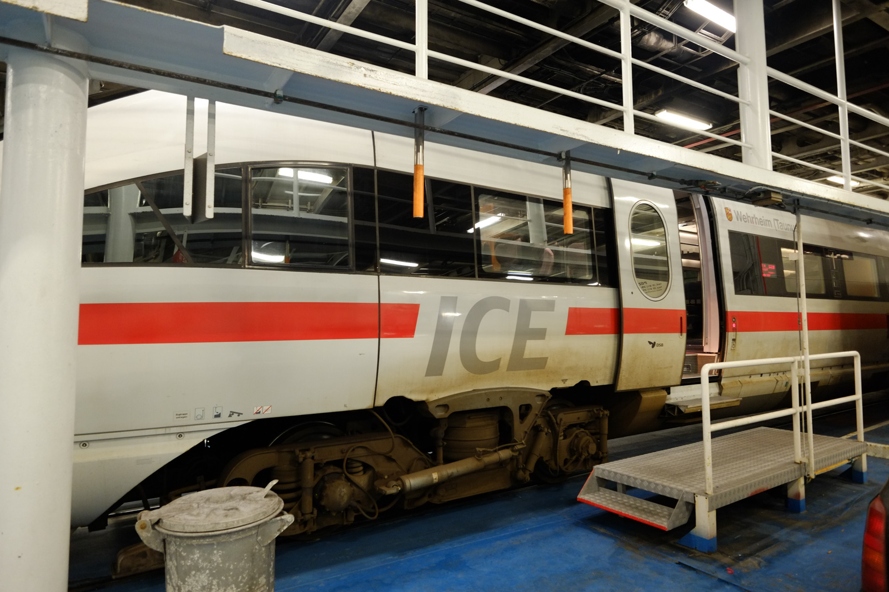
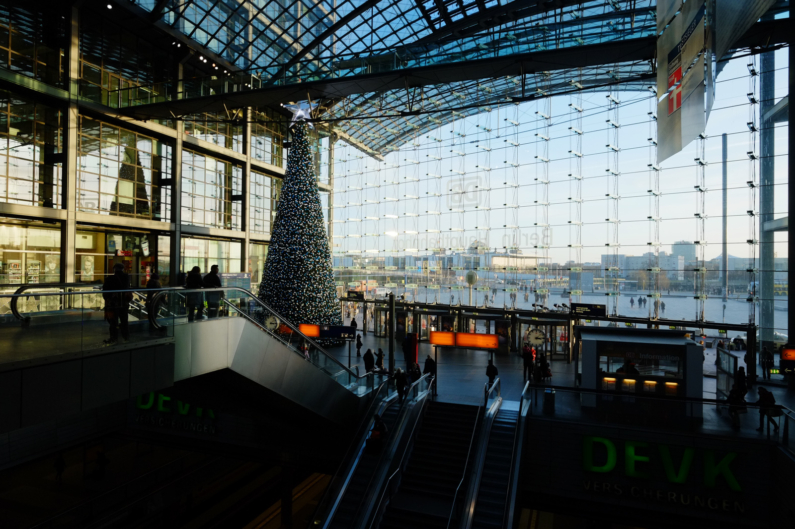
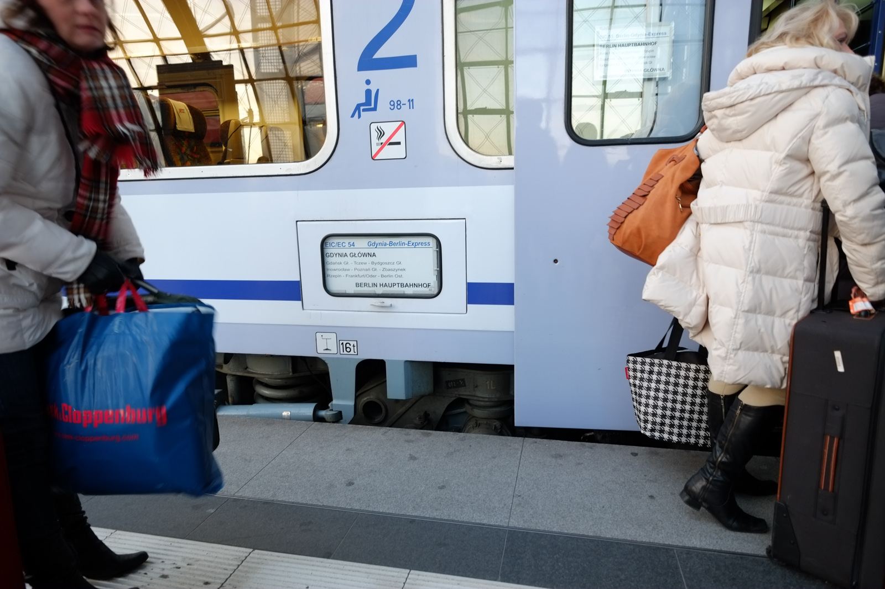

I traveled by train, and this post is an account of my experiences and a warning for others who might be attempting the same thing. It costed a lot of money, but most importantly, it was a very exhausting and stressful experience. So if you're reading this and planning on doing the same thing – don't.

First of all: why did I do it? Well, there's a couple of reasons. First was curiosity – I like trains, and I really wanted to try that kind of long international train travel. Second was finance – plane tickets have a tendency of becoming ridiculously expensive before Christmas, and I had a hard time finding the sort of tickets I wanted (BGO–WAW, POZ–BGO), so I figured that trains can be cheaper. In the end they weren't, but they weren't significantly more expensive either, and given that I've had **a lot** of flying last month, I decided I'll give the train a chance.

Secondly: how did I do it? Well I checked a couple of possible connections via [the best railway connection finder in the world](http://bahn.de), and I decided to go like this:

- morning train from Bergen to Oslo;
- Oslo to Katrineholm;
- night train from Katrineholm to Lund;
- Oresund train accross the sea to Copenhagen;
- ICE 38 from Copenhagen to Berlin;
- and a EuroCity from Berlin to Poznań, where I'd meet with my friends and
continue to my parents' place by car.

So that was the plan, and it looked good. In the end I managed to arrive in Poznań on time, but there was a lot of stress and some adventures on the way.

I took off from Bergen at 8am. <a href="http://en.wikipedia.org/wiki/Bergen_Line">Bergensbana</a> is probably one of world's most beautiful train routes, but not in December. The sun doesn't rise until ~9:40, so you can't see any of the beautiful fiords of Western Norway.

By the time it's daylight, the train reaches <a href="http://en.wikipedia.org/wiki/Hardangervidda">Hardangervidda</a>, and everything's just <em>white</em>, but you won't even see that, because the train goes through the snow like a giant plough, and in effect all you see through the windows is a giant white cloud.

It gets better in Eastern Norway as the train approaches Oslo, but then again the landscape becomes a bit boring there. But apart from all that, the Bergen-Oslo train was one of the best parts of my trip. The train itself is comfy, there are power outlets in 2nd class, and it was on time.

So, Oslo S. It's nice there. I went upstairs to grab a bite, and while I was waiting for my burger the big display that lists all departures showed that my train to Sweden is cancelled. ‘Fantastic', I thought, ‘but let's finish the burger first and then think what to do next.' My immediate thought was to call SAS, book a one-way ticket to WAW and forget about all that train non-sense. This is also the moment of the trip when stress comes into play.

See, because when you travel by plane, you can book travel with multiple legs operated by different carriers and have it all on one ticket, so if one part of your trip gets cancelled or delayed, the rest of it gets adjusted somehow and it's not your problem. With international train travel it's different. I tried booking everything with Bahn.de, but that's apparently impossible, so I ended up having tickets bought from 3 companies: <a href="http://nsb.no">NSB</a>, <a href="http://sj.se">SJ</a>, and <a href="http://bahn.de">DB</a>. If I got lost somewhere in Sweden due to delays, I'd lose my German tickets and seat reservations, because it's not their fault SJ fucked things up. So when I learned that the train to Stockholm is cancelled, I got worried. But I figured it could still all work out fine, because I booked my tickets with generous transfer times.

I walked towards platform 19 at Oslo S and jumped on a bus[^1] to Karlstad, where an inter-city train number 58 to Stockholm would await all the passengers. And despite it being a relatively old and crowded bus, it brought us all to Karlstad pretty quickly. Actually there were two buses – a lot of people. We all stood on the platform and waited for the train (which couldn't have been late, because that where its route started), and then someone announced through the speakers that the train will be delayed, 1 hour. There wasn't even enough room at the station for all of us to fit. The train arrived after about 30 minutes, so it wasn't all that bad, and even though the carriages looked very old from outside, they were very comfortable and modern on the inside. The problem was the train number 58 didn't really move anywhere. We stood in Karlstad for an hour or more, so I was getting worried again that I won't make my night-train connection in Katrineholm. I had 2 hours allocated for the transfer, but in the end I only spent 20 minutes there because of all the delays. Mind you, there was no snow in Sweden, so I've no idea why there were so many problems with SJ.

Katrineholm is the Swedish equivalent of <a href="http://en.wikipedia.org/wiki/Koluszki">Koluszki</a> – apparently the only reason to be there is to get off of one train and get on another one – but the night train Stockholm-Malmö arrived on time, and it was way more comfortable than I expected. I had a couple of hours of sleep and got up at 5am to get off in Lund Central and make another train – <a href="http://en.wikipedia.org/wiki/%C3%96resundst%C3%A5g">Øresundståg</a> to Copenhagen. This part of the trip was relatively uneventful, and when I got to Copenhagen, I finally had a decent morning coffee.

Copenhagen station was pretty busy, and, as always, full of junkies. Anyways, I finished my coffee and went to platform 4, where an ICE 38 train to Hamburg/Berlin arrived and took me to Germany.

So here's the thing about ICE. It's advertised as high-speed, premium service by DB, and it usually is. I mean, I hope it usually is, because my ICE experience was definitely the worst part of the trip.

First off, ICE 38 is nowhere near high-speed. It's a *diesel high-speed train*, geddit? It's diesel, because tracks in southern Denmark aren't electrified, and because it has to be loaded on a ferry (!) in order to cross the Fehrman belt (from Rodbyhavn to Puttgarden).

On top of being slow, the ICE 38 was late. It left Copenhagen on time, but was late for the ferry, was 20 minutes late in Hamburg Hbf, and then it simply broke down. It took another 35 minutes before we left for Berlin. The ridiculous thing about ICE is that it was hands-down the most expensive leg of my journey – the ticket from Copenhagen to Berlin costed €140 (in comparison, the NSB ticket from Bergen to Oslo costed 300 NOK (which is ~€35), the SJ ticket from Oslo to Copenhagen costed 800 SEK (which is ~€90), and the last part from Berlin to Poznań was ~€40 (bought that one very late, would have been much cheaper if booked earlier)). For €140 I'd expect much more.

I arrived pretty late in Berlin Hbf and only managed to grab a shot of the Christmas tree:

and had to run to catch the EuroCity train to Gdynia which was already waiting. Didn't even manage to buy any <a href="http://en.wikipedia.org/wiki/Hanuta">Hanutas</a>, and it's all your fault, Deutsche Bahn.

Now comes the final part: a Polish train operated by <a href="http://en.wikipedia.org/wiki/PKP_Intercity">PKP InterCity</a>. If you ever lived in Poland or known any Polish people, you'd know that PKP has the worst possible reputation in my homeland. So it came as no surprise when I saw the train looked pretty bad from the outside,

but it came as a *major* surprise that it was brand new, roomy and comfortable inside. More than that, it was fast, on time, and they served free snacks + coffee/tea/juice in 2nd class. So, yeah, turns out that PKP InterCity was the cheapest and best part of my whole journey, by a fat margin.

In the end, I wanted an adventure and had one. I remember I used to enjoy traveling crazy routes with many transfers when I was a teenager in Poland, but doing the same on a European scale is much more annoying and possibly much more expensive (thus also stressful). Also, winter in central Sweden is never warm, and people tend to have more than one piece of hand luggage before Christmas. My one-way plane ticket from POZ to BGO with SAS costed less than a €100, and the flights+transfers will most likely take less than 40 hours.

So if you're thinking of doing what I did, just *don't*. Happy New Year.

[^1]: Kudos to NSB staff by the way. When trains get cancelled/delayed in Poland, no one knows anything. NSB handled everything very well and there was a lot of helpful people that explained where the buses are and where you should get off. 
