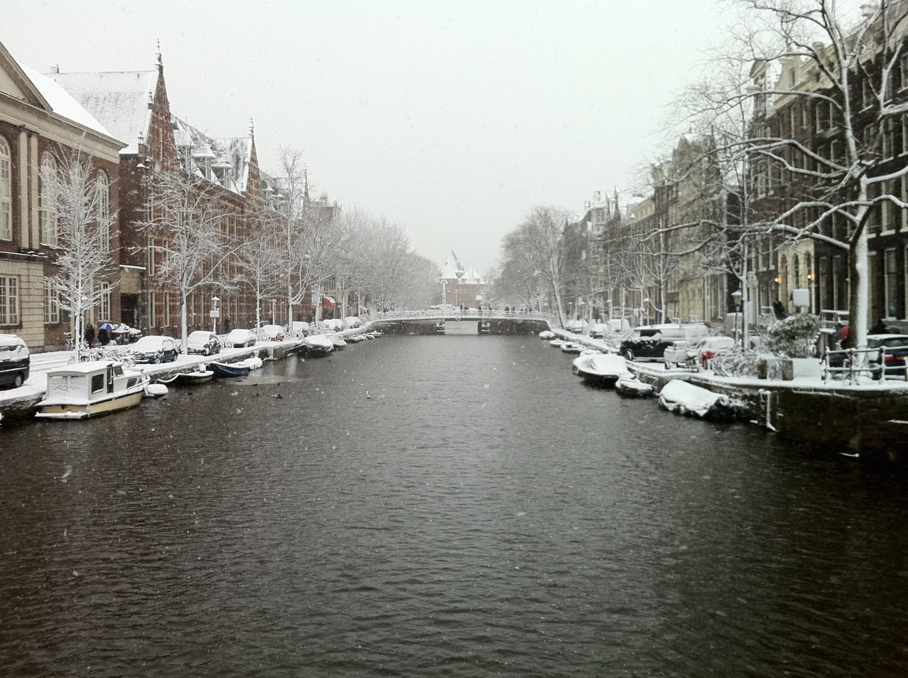

I like taking photographs, and I *love* cameras.

My grandfather was the first professional photographer in my hometown,[^1] and I loved playing with his cameras. His darkroom was my favorite place on Earth, filled with cameras, lenses, and a huge [enlarger](https://en.wikipedia.org/wiki/Enlarger) in the middle of a table. I spent hours playing there, and perhaps that's what sparked my interest in photography, but it was definitely what sparked my interest in photographic gear.

My grandfather gave me my first camera. It was a DDR-made [Praktica B100](http://simonhawketts.com/2014/09/13/vintage-camera-collection-praktica-b100-electronic/) semi-automatic SLR with a 50mm Pentacon f/1.8 lens. It was so superior to all the Soviet Zenith SLRs my high-school friends had, and its optical performance made my poorly composed photographs look at least decent. I cherished that camera and enjoyed every minute with it, and I actually still do, although sadly I haven't shot film since 2010.

I learned a ton[^2] shooting film with the Praktica B100, and I learned to love *bokeh* of f/1.8 above all, like every mediocre photographer. Shooting film was, unfortunately, expensive, and when I finally got a part-time job in college in 2006, I was able to afford one of the greatest cameras ever made—the Nikon D40.

## Nikon

Nikon D40, which I bought with a first generation, terrible 18-55mm f/3.5-5.6 kit lens, was brilliant because, like its rival Canon EOS 400D, it was *very* cheap. It was the first of Nikon's DSLR to "feature" the lack of AF motor in the body, which meant you had to buy the newer AF-S series lenses if you wanted to use autofocus, and it looked cheap and funny compared to bigger DSLRs. It produced decent images, though (especially the RAW files), it was easy to use and ergonomic, and sold very well. Funny thing about this cheap, entry-level DSLR is that I still have it today. It's been with me on many, many trips, thrown around, used in rain and snow (which I neither recommend nor condone), and it didn't once break.

I bought a big, "all-purpose" lens for the Nikon in 2011, which was still optically almost as poor as the kit lens, but gave me the 18-250mm focal length and a sore shoulder every time I had to haul it somewhere. I liked that, though. Despite the fact that my photographs weren't particularly good, I felt that the more *gear* I have, and the more serious it looks, the better. I took a lot of nice pictures during the many, many travels, but the more time passed, the more I realized that the Nikon stays at home quite a lot, simply because it's too big, and too heavy.

It was 2012 and the whole mirrorless revolution was at its peak, with all major manufacturers embracing either the micro 4/3 format or trying to put APS-C (or even [full frame!](https://en.wikipedia.org/wiki/Sony_Cyber-shot_DSC-RX1)) sensors into smaller bodies. I wanted to jumped on that wagon.

## Fujifilm

I bought a Fujifilm X10. It had a sensor smaller than micro 4/3, it rendered pleasing colors (hello, [Velvia!](https://en.wikipedia.org/wiki/Velvia)), was portable, had a lot of manual controls and was a very enjoyable camera. It had a fixed lens, though and couldn't really produce any shallow depth-of-field, which I, as a still mediocre photographer, really missed. I liked Fujifilm colors and manual controls (and, yes, retro aesthetics), so I bought another mirrorless camera, the X-E1, together with two absolutely brilliant lenses: 14mm f/2.8 and 35mm f/1.4.

I loved the X-E1 despite its numerous flaws, and I really enjoyed shooting with it; it was a camera that, through its manual controls and well thought-through interface, made you *want* to go out and shoot. Still, it wasn't exactly pocketable. Yes, the body was relatively small, but the lenses were big and heavy. So I sold both my Fujifilm cameras, all the lenses and accessories this Spring.[^3]

## The smartphone revolution

I'd say there are three types of photographers.

1. The type that shoots candid photographs with a smartphone, didn't have a camera before the iPhone era (or had a cheap compact one), doesn't care much about the quality (either artistic or technical) and just "takes photos." I.e., the great majority of world's population.

2. The *photographer,* and I don't mean that sarcastically. This person takes great photographs and takes great joy and pride in that. The gear is completely secondary. This category is represented by the small minority of world's population, but somewhat includes my girlfriend.[^4]

3. And finally there's the *enthusiast.* Enthusiasts know about the gear, know about composition (which doesn't necessarily mean their photos are well composed!), and know about technical aspects of photography. They can distinguish a bad image from a good one, and some of them are also *photographers.* Sadly, not all, and I'd even say most enthusiasts are in it for the *gear.* I am a proud member of this category. I like taking pictures. I envy the *photographers* their skill and talent. I take hundreds of photographs and every now and then I take a good one. I'd say it's about 1% of all the pictures I take, but that's okay. Once I do get that great shot, though, I want it to be of great technical quality, so that I can print it and proudly hang on my wall. That's why I'm into gear. That's why I didn't want to take photographs with my smartphone.

Craig Mod was right when he wrote ["Goodbye, cameras"](http://www.newyorker.com/tech/elements/goodbye-cameras) back in 2013 already, but I didn't believe him.[^5] I did take some nice shots with my iPhone 4, but they were never really sharp, and the colors never really looked right. Years of using (D)SLRs also made me addicted to using a viewfinder, and I always found framing pictures without it uncomfortable and inaccurate. But the smartphone cameras got better and better, and their displays grew bigger and brighter (which made using them for framing photographs much better) I always had one in my pocket, too.

It's not only the optics and sensors of smartphone cameras that are improving as technology progresses, but the software, too. I'd go as far as saying that it's the software that lets you get the most out of smartphone photography. Take a look at the photograph below.

 last weekend.")

I have shots of the very same place at the very same time taken with the Nikon DSLR. Despite the Nikon having more than twice the size of a sensor, shooting RAW and pulling shadows in post-processing, it can't beat Samsung's subtle-but-effective HDR mode's dynamic range. In these conditions even the Fujifilm's excellent X-Trans sensor would struggle, yet my smartphone's tiny sensor aided by great, built-in HDR software manages very well. Here's another one.

.")

Galaxy S5's HDR mode gives exactly the amount of detail and dynamic range for photographs to look more than decent, yet the fact they are shot in HDR is not immediately obvious.

After coming back from the Dolomites I transferred all the photographs to my computer, and realized that the majority of great shots from that trip are from the phone. It renders colors better than the Nikon, it has better dynamic range (thanks to its clever HDR mode), it's orders of magnitude smaller and lighter, I always have it with me, it geotags the photographs, and can back them up to Dropbox on the fly if I so wish. I understand of course that this particular comparison is unfair towards the DSLR, because our D40's sensor is 7 years old.[^6] Still, the sole fact that this comparison is possible made me wonder if I still need *a camera*. The truth is, I don't. I would actually sell the D40 setup if it was worth any money.

## The dawn of my camera

I love cameras. I love that they're purpose built, precise tools. Modern Japanese DSLR are of course very much like computers, in as much as most of their operation is controlled purely electronically, but then again a lot of camera elements, like shutters and of course lenses require very precise craftsmanship. That's pretty rare when it comes to consumer goods available in the 21st century.

Smartphones have smaller sensors, which currently causes problems with depth of field control and noise, but as the technology matures, these may no longer be issues in, say, 5 years from now (I'm looking at you, [Lytro](https://www.lytro.com/)). I don't think the problem of having a single focal length will ever be solved, so obviously in situations when you either need a very long lens (nature, sports photography) or a very wide one (architecture, landscape to some extent), good old cameras will remain the best, if not the only option. For the great majority of people, they will stop making sense. Suddenly it turns out, I'm one of these people.

My first thought after coming back from Italy was to go on Amazon and take look at some new cameras to replace the aging D40. I looked at full-frame offerings like the D610 or Sony A7, then also at my favorite Fujifilm with its spectacular X-T1, and then I took another look at the pictures taken with the Samsung, and realized I won't be buying a new camera. And while I feel a bit sad about it, because of how much cameras mean to me, I'm feeling optimistic about the future.

It's definitely a bad time to be a imaging equipment manufacturer. But it's a very exciting time for photography.

[^1]: It is probably worth mentioning that [my hometown](https://en.wikipedia.org/wiki/Skierniewice) is a bit of a shithole, a city of almost 50,000 inhabitants in central Poland, half way between Warsaw and [Łódź](https://en.wikipedia.org/wiki/Łódź), essentially a big bedroom for both. Still, I always considered my grandfather's achievement of being a professional photographer no small feat, given his complete lack of education (because war and such).

[^2]: No, really, I learned a lot about photography back then. With my high-school friend Leon we even took some crazy multiple-exposure night shots using flashlights; I'm pretty sure he still has these photos somewhere. Great times.

[^3]: Actually the direct reason for why I sold all that was because I was in a financial ruin and needed some money. This is what happens when you spend too much money on photography gear, kids.

[^4]: "Somewhat," because I don't think she'd describe herself as a photographer, since her interest in photography isn't that great. She's also pretty dumb when it comes to technical aspects of photography, but it doesn't matter how poorly the settings are set on her camera—her photographs are always at least good, and sometimes brilliant. Paradoxically this also means that my girlfriend's best photographs came from her iPhone, because there were no settings to set (i.e., mess up).

[^5]: Take a look at his own [follow-up essay](http://craigmod.com/journal/photography_hello/) as well.

[^6]: Mind you, the Samsung Galaxy S5 is also not the latest generation technology. To see what the iPhone 6 Plus is able to produce, head over to [Austin Mann's website](http://austinmann.com/trek/iphone-6-plus-camera-review-iceland).
