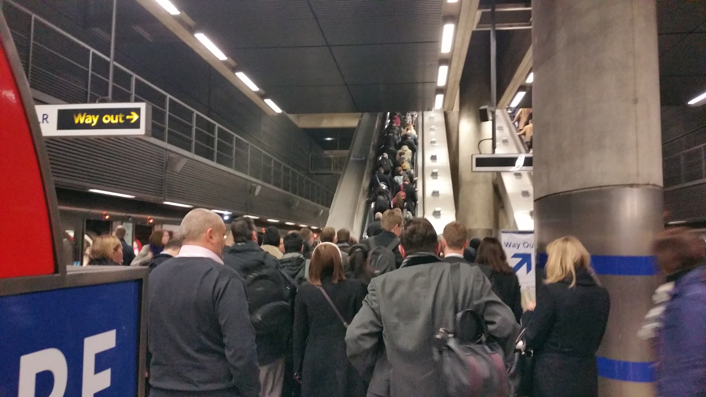

A couple of weeks ago <a href="http://cloudreach.com">my company</a> sent me over to London for 6 weeks to do some project work for one of our clients. I'm back in Munich now, but everyone's been asking me how it was and I have surprisingly many things to say about my stay in the UK. Thus, to ease my pain of having to tell everyone the same bunch of observations, I decided to group them all neatly into a blog post. Here goes.

## London is *big* and *crowded*

Depending on the definition, the London metropolitan area has between 8,5 and 14 mln inhabitants. By European standards this makes it a <em>huge</em> city, and having never lived in a place that had more than 2,5 mln people, you can really feel the difference. The most visible effect of that enormous size is of course overcrowding.

I remember visiting London a couple of years back, admiring the architecture of old tube stations with the small, *nomen omen*, tubular size of the trains, and finding it all adorable. Well, tell you what, it loses all its charm when you try to get on a Jubilee line train at 8:30 AM.

Moving around the city during morning or evening rush hours means standing in some sort of a line most of the time. You queue for the trains (I never managed to get on the first or even the second Jubilee line train in the morning, not to mention the Central line), you queue to the stairs, and then in many other places you also queue even when you leave the station; for example at Faringdon station if you want to cross the street in the direction of Leather Lane the queue (~50m long) to the zebra crossing starts right at the station exit.

This is not to say that [TfL](http://tfl.gov.uk), the non-profit organization that runs London's public transportation system, isn't brilliant. For the great majority of the time the trains run on schedule (and even if they don't, TfL is really good at informing passengers about issues on any lines), and they run often, so if I say that I had to wait until the 5th train arrived to get on one it doesn't mean I actually had to wait that long. The problem London has is that there is no limit to the amount of people that want to move there. An example that illustrates this is the contruction of [Crossrail](https://en.wikipedia.org/wiki/Crossrail), London's new East-West underground link. The company that builds it expects Crossrail to reach its full capacity *on day one* of operation, which will be sometime in 2018, and that Crossrail will improve London's public transportation by mere 10%.[^1] Another line, Crossrail 2, is planned to alleviate the problem, but if the city's population keeps growing at its current pace, London's gonna need Crossrail 4 by the time Crossrail 2's planned opening.

The overcrowing obviously translates to traffic jams in central London. It is absolutely bizarre, but you can be stuck in a traffic jam on a Sunday at 11 AM, as well as on Friday at 11 PM, not to mention rush hours. The city center is permanently clogged, its narrow streets completely incapable of handling the amount of traffic despite the congestion charges.

## London's cultural offer is unmatched

As much as annoying the huge size is, it comes with massive cultural benefits. For a jazz enthusiasts such as myself, the offer is magnificent. [The Vortex](http://www.vortexjazz.co.uk), [Ronnie Scott's](http://www.ronniescotts.co.uk), and [Cafe Oto](https://www.cafeoto.co.uk), just to name a few, have great concerts every weekend (sometimes every day), they're not expensive (modulo Ronnie), and they present a whole spectrum of jazz, from traditional big bands and swing, through post-bop influenced quartets, all the way to the latest avang-garde punk jazz trios. And that's only jazz. There are dozens of classical, rock, electronic, r&amp;b and basically *any-other-kind-you-want* music concerts all the time. Visual arts fans can go to Tate Modern which always has great exhibitions, theatre afficionados can choose between 40 different theatres in the West End alone, and really, when it comes to culture, the sky's the limit in the city of London. Or rather, your wallet.

## London is *beautiful*

Londoners tend to forget about it, because they live their busy lives running from one tube station to another, but London is a beautiful city with magnificent history and a fantastic mixture of the (very) old and the new.

## London is *diverse*

The team in a project I worked on consisted of myself (Pole), a Finnish-Italian, a French-Portugese, an Indian, a Kiwi, a Canadian, and a Brit from South England. And it's not unusual by London standards. The ethnic, cultural and national diversity of the city doesn't just make it more exciting or interesting to be there; it makes becoming a Londoner much, much easier. As a person who left his homeland 7 years ago and has been living in many other countries, I have to say those 6 weeks in London made me feel at home very quickly. Being able to speak fluent English definitely helped, but being surrounded by locals who were either (a) expats like myself or (b) used to interacting with the likes of me really made me feel like I could become an integral part of that, if you pardon my expression, melting pot. Something I cannot really say about Munich or Norway, or Belgium, or The Netherlands, sadly. 

## Wrapping it up

When I visit places for a longer period of time, I also wonder whether I'd be happy to move there. I came to London in the summer of 2012 and back then I thought it's an absolutely perfect city in every way, and that I'd move if an opportunity came my way without hesitation. Now, after living there for six week and experiencing the life of an ordinary Londoner,[^2] I'm not so sure any more. Staying in London for a couple of weeks only made me appreciate Munich's laid back atmosphere much more, and even though I don't have solid data on the subject, I'm pretty sure the average living standard here in Bavaria is much higher than in London. Still, even with its terrible overcrowding and ridiculously expensive beer, I can see the appeal of living there. And given many work opportunities for K, we might relocate to London some day. 

Until next time, then. 

[^1]: This is what [the Guardian article](http://www.theguardian.com/uk-news/davehillblog/2013/dec/31/london-underground-writers-on-tube-future) says, but apparently it's [controversial](http://www.londonreconnections.com/2014/happens-crossrail-full-part-1-problem/). 

[^2]: Well, not entirely ordinary, I got to live in **Zone 1**, my company got me a really nice apartment. Did I mention [we're hiring](https://www.cloudreach.com/gb-en/careers/), and that we have a picture of a naked man on our careers page?
