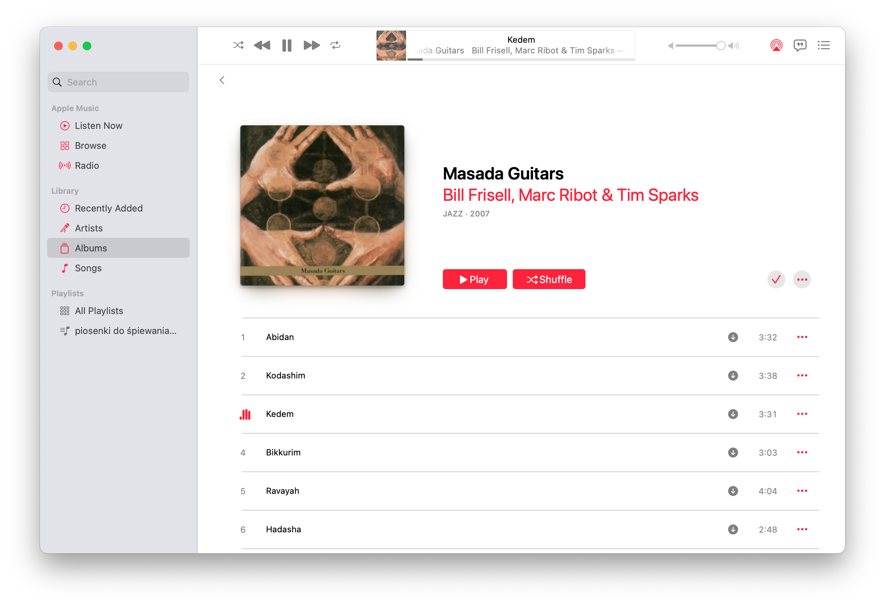

I've been testing Apple Music recently and I discovered that it still supports uploading local files to iCloud Music Library. The interface of Music app is indeed somewhat [atrocious](https://daringfireball.net/linked/2021/04/02/your-product-sucks-apple-music-mac), but look:

It integrates music that isn't available on any streaming platform with all my streaming albums and playlists! And it gets better: playlists can contain both music from my files and streams. 😮➡️💥

As far as I can tell, no other streaming service can do that. 