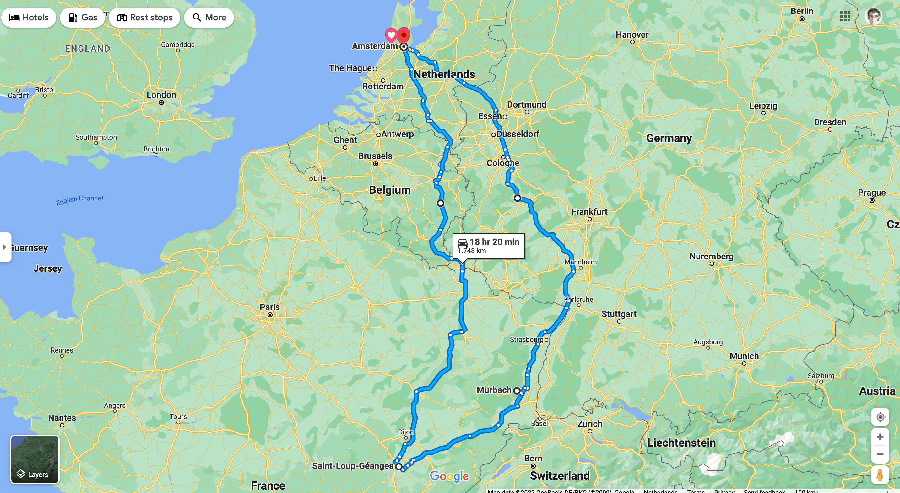
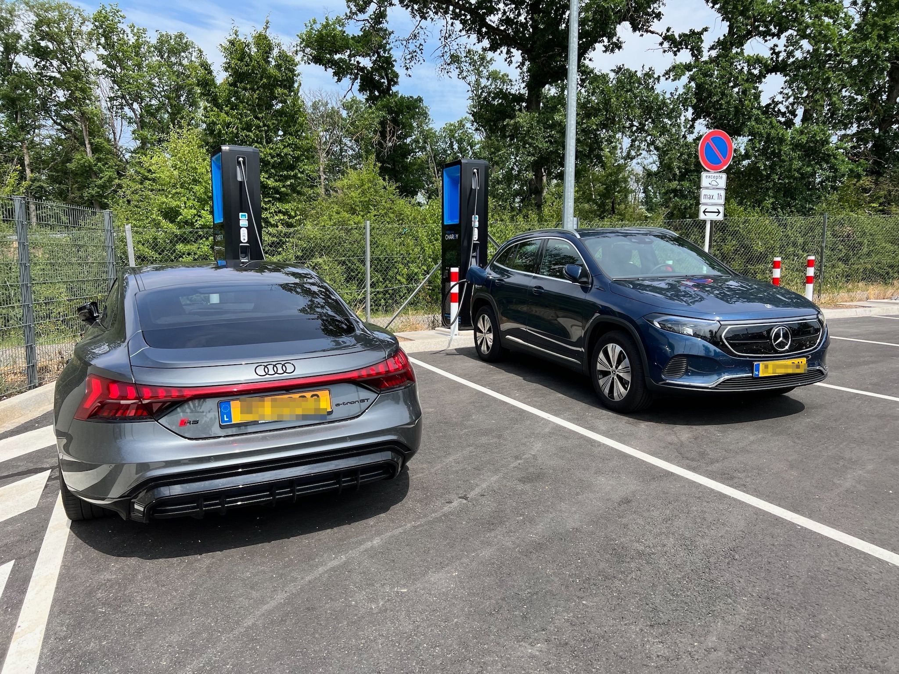
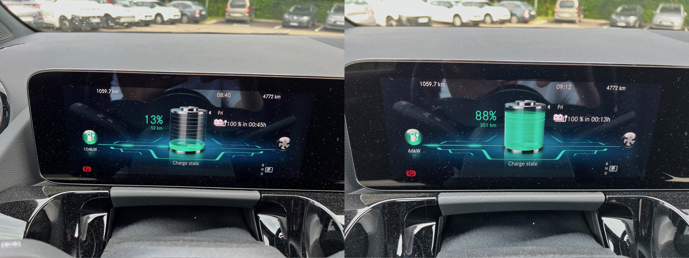
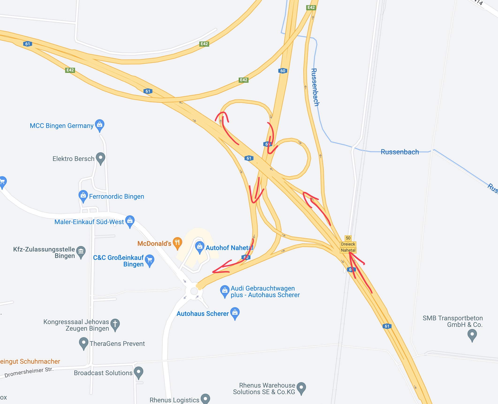
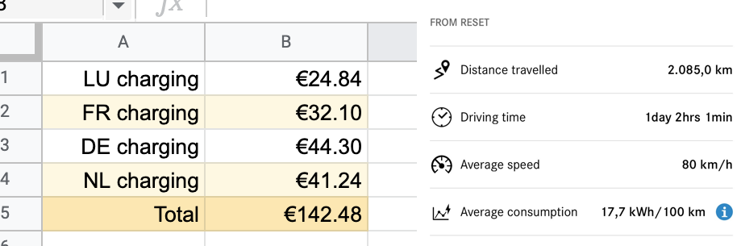

**tl;dr:** It's easier than you think. 

A few weeks ago I decided to take a short trip from The Netherlands to France. It was a Tuesday evening, and I wanted to leave on the morning of the next day, so there was little planning involved. I booked what little hotels Burgundy and Alsace still had to offer, packed my suitcase and went to bed. In the morning I went down to the garage, put my bag in the trunk, and just asked my car's built-in navigation to take me to a small village south-east of Beaune, roughly 800 kms away. And off I went. 


An obvious disclaimer here is that all my experiences apply to the Low Countries, Germany and France. I don't exactly know how the situation is in other regions of Europe, but from googling around I would wager Italy and Spain are much like France when it comes to the infrastructure, and Scandinavia is more like the Low Countries. Eastern EU I expect to still be The Land of Great Adventure when it comes to EV road tripping, which I will likely investigate in detail in the near future. Stay tuned I suppose?


## What works well

My car is a poor man's Mercedes, the basic EQA. It's a relatively inexpensive EV with a 300-ish kms of highway range, a 100 kW peak charging capability, and a pretty [flat charging curve](https://www.youtube.com/watch?v=jPsKpCMvfls). Great thing about it is, though, that its built-in navigation adds fast charging stations along the route automatically and pretty much flawlessly. I've had the car for only a couple months, but it's been reliably routing me through convenient, fast, and available chargers. 


Ok, let's talk about EV prices for a second. EVs are notoriously expensive to buy. They are cheaper to lease and they are very cheap to run, but no EV can beat the value of, say, a 5-6 year old Japanese hybrid, with its low running costs and reliability. This being said, my "fancy Mercedes" is still cheaper than the cheapest Tesla you can currently buy in Europe, and cheaper options (mostly from Korean brands) are becoming available. 


This, as I learned, is an important detail. A friend of mine rented a Hyundai Kona for a trip recently, only to learn that this particular Kona's navigation system wouldn't automatically include charging stations along the way. It was up to the driver to find them and navigate to them. As far as I know Tesla, Volkswagen group, BMW and Mercedes cars all have navigation systems that will automatically route to charging stations. Not sure how Stellantis, Ford or current, well-specced Hyundai and Kia cars are, but if your EV doesn't route you to charging stations, trips will require more planning. I'd recommend the [ABRP](https://abetterrouteplanner.com/) app or simply the [Ionity](https://ionity.eu/) charger network app for Western Europe, but yeah—it's more hassle for sure. 

I found charging along the highways to be, essentially, a solved problem. Everywhere I went so far the network of fast chargers was dense enough to not have to worry about it too much. I also haven't experienced _ladestau_ anywhere, despite this trip being during peak holiday season and coming back on the weekend. I had to wait for an available charger at an Ionity station in France once, but the wait was less than 5 minutes. In fact in a vast majority of cases I was the only car charging, especially in France where EVs don't appear to be as popular as they are in the low countries or Germany. 

I would also say that 100 kW charging speeds are more than enough. In a car with a medium sized battery (roughly 60 kWh) this translates to charging from 10% to 90% in about 30-40 minutes. It may sound like a long time, but if it's your first break after driving 200-300 kms, you'll want a toilet stop and you'll likely want to grab some food, too. At a busy European _Autohof_ this will take 30 minutes at the very least, and that's if you don't have kids. So, really, most of the time I'd get a notification on my phone that we're ready to go before I finished sipping my overpriced, disgusting, gas station coffee. 

Finally, driving long distances in an EV is pleasant. Again, even a relatively inexpensive one, like my EQA, is quiet, comfortable and provides ample power for overtaking. Granted, I am not comparing it to a luxury combustion engine car, but to a compact hatchback that I've had before, but I'd say that makes my comparison all the more representative.

## Caveats

By far the main issue with traveling in an EV is the availability of chargers at your destination. Everyone's been panicking about charging along the highways and we got lots of fast chargers at service stations and such, but city charging infrastructure simply doesn't exist outside of the Netherlands. My hotels had "EV charging stations," which meant they offered a single 230V outlet that was sometimes available. Charging a 60 kWh battery from a household socket takes around 30hrs, so if you arrive with 10% charge, you'll have about 40% the morning after if you charge overnight. That's not great, because if you drive around French villages on a sacred mission of finding great wine, by dinner time you'll be at 10% again. Finding public chargers (aka AC chargers) is not only hard but I found that my Dutch charge card wouldn't work with them most of the time. It will always work with international fast chargers like Ionity and Fastned, but with AC chargers it's hit or miss (and more miss than hit for sure).

The second issue is that while fast chargers are plentiful, they are not as plentiful as petrol stations. In most cases it doesn't matter. Until you miss your exit, that is. Here's the thing, friends: if your fast charger is right along the highway, it's unlikely you'll miss it. If it's at a service station, an _Autohof_ or something that essentially requires you to _exit_ the highway and drive 1-2 kms away, _and_ if all this is happening at a massive highway intersection that you're unfamiliar with, the chances of taking a wrong turn at some point are high. And if you're at 10% percent charge or less, you simply cannot afford missing a charge. So you need to be very careful.


Here's a neat trick to help with this situation: if your car navigation supports it, and most do, tell it you want a 20% state of charge at minimum before you reach the charger. There's enough fast chargers around for this not to be a big deal, and I prefer making more frequent, shorter stops. This way you'll likely be able to reach another charger if you get confused at _Dreieck Nahetal_ or wherever. Same tip applies for going to destinations that don't have good AC charging infrastructure: simply tell your navigation you require at least 40% SoC at your destination. Is it more expensive? Yes. Does it contribute to your peace of mind? Absolutely. 


Finally, and this may or may not be a big deal depending on your personality, I found that in many places EVs attract attention. In small towns or in countries that don't have a lot of them, you'll be approached by people at parking spots or chargers. Everyone wants to know how far you can go on a charge or how long it takes to charge up, and no one will accept the reality of "it really depends." And a lot of people will try to convince you that EVs are nonsensical, pointless, there's nowhere to charge them, electricity comes from fossil fuels, the grid won't take it, their range is too low, their prices are too high... and so on and so forth. I learned to mostly ignore such people and it doesn't bother me much, but I know for some it's an issue. Best advice is to be rude—people won't wanna talk to you if you're rude ☝️. 

## How much does it all cost?

It's expensive, but cheaper than any internal combustion engine. Here's what it costs to travel 2085 kms using fast charging (DC) on the highway and public chargers (AC) in towns:

This means it costs roughly 7 euro cents to travel 1 km with an EV. If we assume average consumption of 7 liters per 100 kms (small, frugal engine) and petrol cost at €2 then it costs roughly 14 cents to travel 1 km in an internal combustion engine car—an increase of 100%. You could say I am cheating by not including the charging I got "for free" at home before I started or at one of the hotels, but that's not exactly cheating, these are just the benefits of driving an EV. Bear in mind that DC charging is roughly twice as expensive as AC charging, so as the infrastructure of public chargers grows, the costs of driving an EV drops. And finally, big charger networks like Ionity, Fastned or Electra all have subscriptions available. Some, like Ionity, require yearly committments which doesn't make much sense for roadtrips, but others, like Fastned, can be cancelled after a month. My napkin-math suggests that for a trip to France via Luxembourg/Germany it makes sense to pay for a Fastned premium subscription because its costs will pay for itself during a single 10-to-90% charge. So if you do some research about your trip and see what kind of chargers are on the way, you can bring the costs down even further.

---

So there you go. Spontaneous EV trips in (Western/Northern) Europe in 2022 are actually an easy thing to do. There's little to no planning required, the batteries of current mid-range EVs are good enough, and the infrastructure is there. I drove over 2000 kms with zero planning and no major problems, and if it weren't for a complete lack of planning (and lack of French charge cards which one could have ordered before venturing into France had one given it _any_ prior thought), I'd avoid all of my minor issues with charging in towns and villages. 
