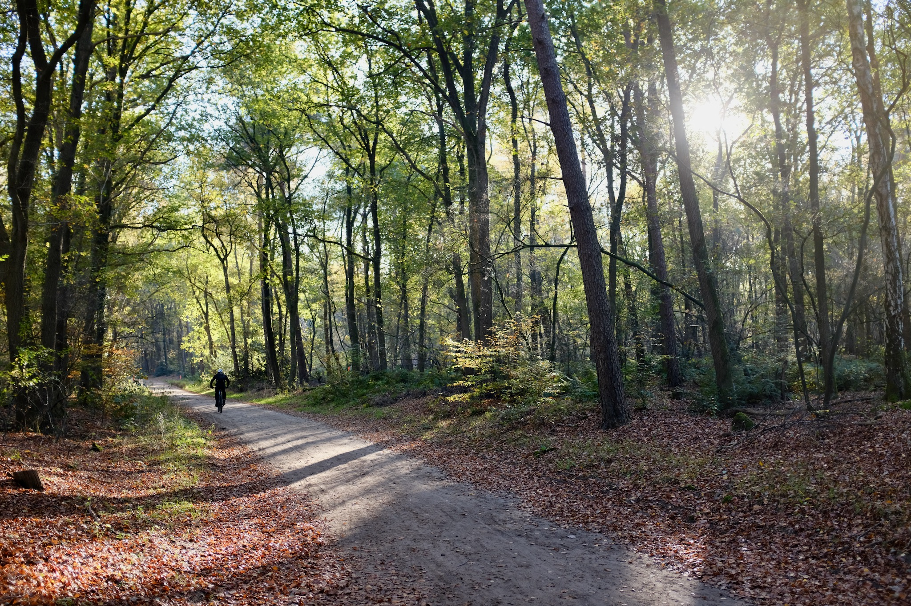
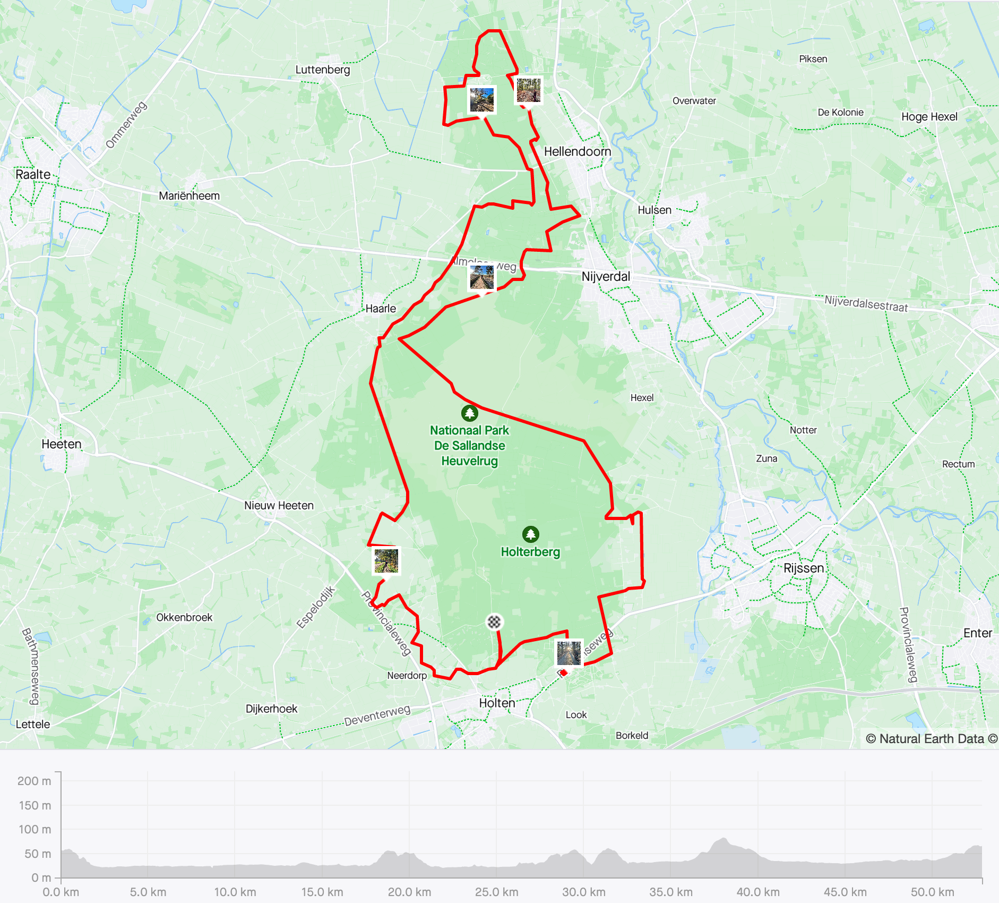

I'm starting a new series of posts where I'm gonna highlight my favorite gravel routes in The Netherlands. Today, it’s [Sallandse Heuvelrug](https://gravelrides.cc/sallandse-heuvelrug/), a great route in one of the national parks in the eastern part of the country. What makes it great is that it’s not too long, but not too short, it has varied terrain and nice landscape, and most importantly the route is mostly free of people (in stark contrast to the gravel routes in the middle of the country, in places like Veluwe, Lage Vuursche or Het Gooi). The only downsides are its distance from Randstad and the fact that you can’t cycle there in the summer. But other than that A+, amazing route!

